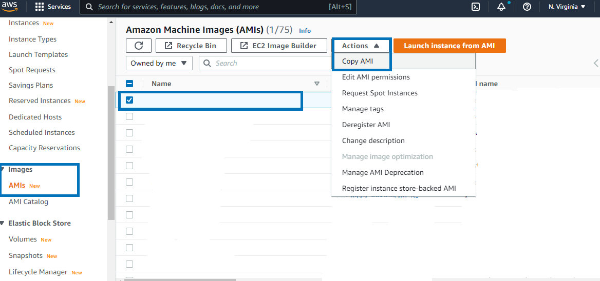

## Enable EBS Encryption from CloudFormation
#### Sample Scenario: 
###### You created an EC2 Instance using a CloudFormation Template. By default the disk attached i.e. EBS Volume attached to the EC2 is not encrypted. You company follow compliance standards that requires storage volumes to be encrypted.

#### Problem
###### Your EC2 is stateful. Changing EBS Encryption to True in cloudformation will delete the previous volume. You do not want your data to be deleted.

#### Solution
Situations like this can get tricky due unavailability of straightforward solution and due to lack of resource.
  
  Here is a workaround
##### 1. Create an AMI from your instance  

Creating an AMI automatically creates a snapshot. So you also have a backup snapshot. You can use this backup in case of any disaster.
Below is a powershell command to do the same
```powershell
$INSTANCE_ID="i-xxxxxxxxxxxx"
$AMI_NAME="UNENCRYPTED_AMI"
$SNAPSHOT_NAME="UNENCRYPTED_SNAPSHOT"
aws ec2 create-image  --instance-id $INSTANCE_ID  --name $AMI_NAME  --description $AMI_NAME  --tag-specifications "ResourceType=image,Tags=[{Key=Name,Value=$($AMI_NAME)}]" "ResourceType=snapshot,Tags=[{Key=Name,Value=$($SNAPSHOT_NAME)}]"
```
You can even do the same step manually

##### 2. Create a Copy of your AMI  

AMi creation takes time. Once unencrypted AMI is created then create a copy of your AMI. While making a copy we have to enable encryption. Enabling Encryption in this stage is very important. All EBS ceated from an encrypted AMI wil always be encrypted. 
For Encryption AWS will ask for KMS Key. You can leave all values to default and let AWS create and manage KMS Key for you.

Below is a powershell command to do the same  

Modify `REGION` and `AMI_ID_TO_COPY` accordingly
```powershell
$REGION="us-east-1"
$AMI_NAME="ENCRYPTED_AMI"
$AMI_ID_TO_COPY="ami-xxxxxxxxxxxxxx" #Copy AMI ID you get after completing Step 1
aws ec2 copy-image  --region $REGION  --name $AMI_NAME --source-region $REGION  --source-image-id $AMI_ID_TO_COPY  --description $AMI_NAME --encrypted
```
You can even do the same step manually



##### 3. Modify AMI ID in your CloudFormation Template 
Goto your CloudFormation Template where EC2 is created. Now you need to make sure that the Input AMI ID for your instance is modified and repleced to this new one.

##### 4. Create a Change Set in your CloudFormation Stack and deploy the changes
If your Stack is small you can directly update your cloudformation template or if your Stack is huge then you can create a change set and deploy your CloudFormation Template.

##### 5. Verify new EC2 in EC2 Console
A new EC2 starts with an encrypted Volume. Goto your EC2 console and verify that a new instance is started and has a encrypted volume.