## Important and Useful Linux Commands for Daily Life and Interviews

__________________
#### pushd popd dir
pushd and popd both are a combination of commands that are used to navigate file-system very similar to cd command. Their special feature is that they can store your paths in a stack
```bash
pushd my-folder-1-path # change my directory to folder 1
pushd my-folder-2-path # change my directory to folder 2
pushd my-folder-3-path # change my directory to folder 3
# You are currently in folder 3 and folder-2 and folder-1 are also in stack
# Now you can go back to folder-2 using
popd
# Now you can go back again to folder-1 using
popd
```
`pushd` & `popd` are used when you are navigating FS and want to go back to your previous folder quickly. It is conceptually a stack.
__________________
#### cron cronjob crontab
___
#### free
`free` command gives you details about the Primary Memory(RAM) and swap memory.
```bash
free
```
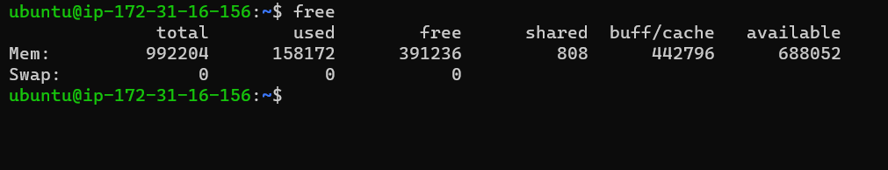
___
#### ps -a
___
#### top
`top` is an interactive tool. It shows the processes running in your system. Along with it also shows hardware details like CPU usage, RAM Usage, swap memory usage and no of tasks running.
```bash
top
```
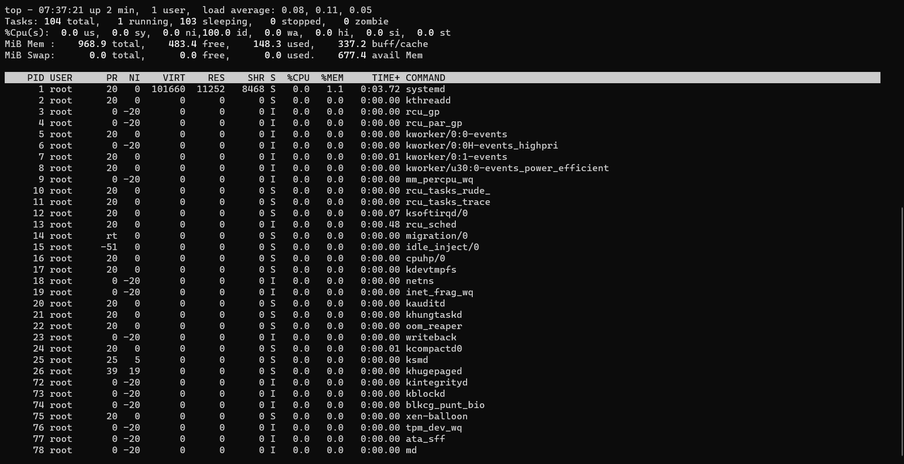
___
#### htop
`htop` is a similar tool like `top` with some more features added like colors, bars etc.  
It is an interactive tool. 

```bash
htop
```
___
#### anacron
`Anacron` is related to `cron` but has a lot of differences. Anacron is used to schedule tasks. It has an advantage over cron, it can run tasks even after the system was shut down, the next time systems starts. It has an disadvantage over cron. Its time granularity is low. Cron has accuracy in minutes but anacron has accuracy in days.  
Use case: You might want to cackup your local favourite folder to cloud, you are not in a hurry if your backup is done a few hours later or tomorrow.
___
#### Ctrl +r
___
#### Ctrl + Left Arrow Ctrl + Right Arrow
___
#### chmod
___
#### chown
___
#### uptime
___
#### cal
It gets calender of the current month in terminal.
```bash
cal
```
```bash
    January 2022
Su Mo Tu We Th Fr Sa
                   1
 2  3  4  5  6  7  8
 9 10 11 12 13 14 15
16 17 18 19 20 21 22
23 24 25 26 27 28 29
30 31
```

___
#### sleep
Create a thread that does nothing for n seconds. Use it to create a delay in your shell script or start a useless process.
```bash
sleep 500
```

___
###### run a command in background using '&'
You can run a command line process in background by ending it with `&`
```bash
python3 program.py &
```
or
```bash
# Create a thread that does nothing for 500 seconds and send it to background
sleep 500 &
```

___
#### jobs
The `jobs` commands keep a track of all the processes running in the background and foreground by the current user.
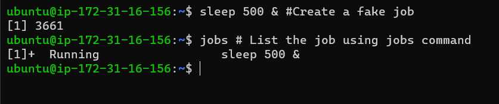
___
###### Ctrl + z
Ctrl + z pauses/suspends a program. You can start the same program in foreground using `fg` command or you can run it in background using `bg` command.
___
#### fg
`fg` stands for foreground. You can bring back a process in foreground that was running in background or you can resume a suspended process using `fg` command.  
If there are multiple processes then you might want to pass parameters also like `fg 3` for third process.
```bash
fg
```
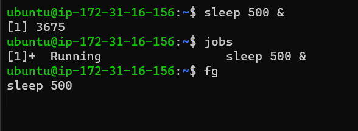
___
#### bg
`bg` stands for background. You can resume a suspended process in background using the bg command.  
If there are multiple processes then you might want to pass parameters also like `bg 2` for second process. 
```bash
bg
```
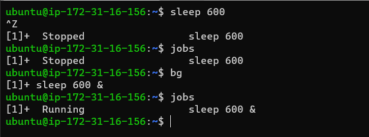
___
###### Difference between bash vs shell
Bash is an extended form of shell. It has more features than shell like endless logs, better compatability with interactive tools like vim and nano.  
bash is located in `/bin/bash` and shell is located at `/bin/sh`.
___
#### ssh
SSH stands for Secure Shell Protocol is used to connect to remote hosts securely. It is some of the most used commands for people who engage themselves with cloud.
``` bash
# ssh -i /path/to/public_key_file [user]@[IP]

ssh -i ./practise.pem ubuntu@3.91.160.159
```
if you ssh very frequently and do not want to use the -i command repeteadly then follow https://github.com/anandshivam44/DevOpsAutomation/blob/main/GenerateKeysAndSSH.md
```bash
ssh ubuntu@3.91.160.159
``` 
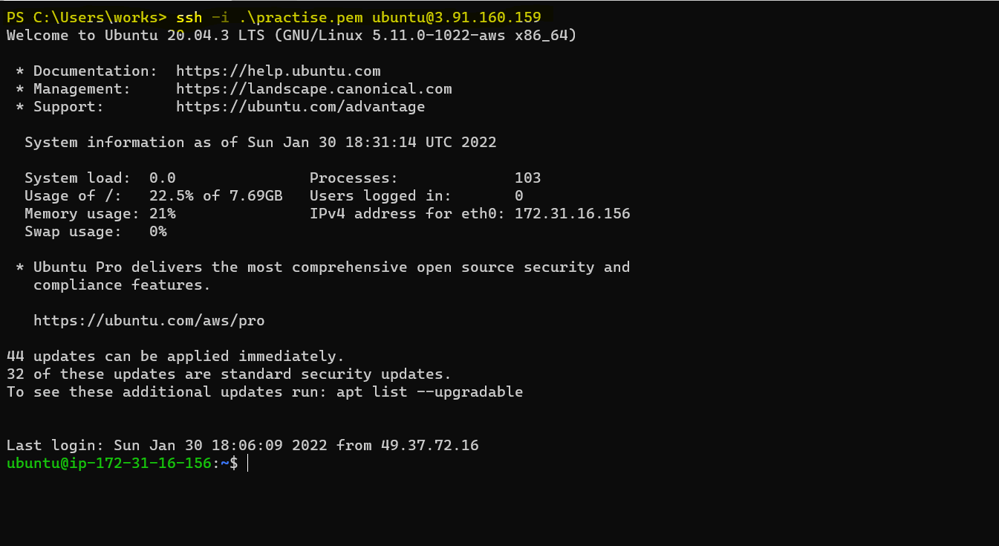
___
#### ping
Ping is used to check the network connectivity to a specified address or IP.
```
ping github.com
```

___
#### kill
___
#### du -sh /var/log/* du -sh /var/log/
___
#### grep 
grep -nr 'anand.shivam44' anandshivam44.github.io/ to find a particular word in complete folder
___
#### free
___
#### pkill
___
#### sed
 sed 's/unix/linux/g' geekfile.txt
___
#### soft link ln -s
#### hard link ln
___
#### rsync
___
###### What is dev/null?
To understand easy, assume `dev/null` is a Black Hole. You can direct output of any commant is scripts to dev/null but it will not be saved anywhere and will not occupy any disk space.  
Use case: If you direct the output of a script to a file then the error message wil be output to a file and your terminal will not show any error. So in our case `dev/null` as a file. A file that doesn't saves anything & doesn't occupies space, direct all spam and noise to this file.

___
#### what is 2>&1
___
#### curl ifconfig.me
```bash
curl ifconfig.me
```
It is used to get your current IPv4

___
#### ifconfig
___
#### netstat
Listening Port: netstat -ntlp
___
.bash_profile
.bashrc
___
#### wc
It is used to find out the number of word in a line. `wc` stands for word count.  
  
Default output gives `the number of lines`, `no of words`, `the number of characters in the file`
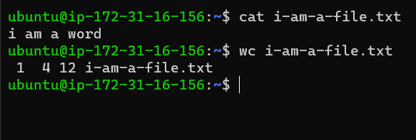

___
#### $env
___
#### vmstat
`vmstat` stands for Virtal Memory Statistics. It privides system information like memory, paging, processes, IO, CPU, and disk scheduling.
```bash
vmstat
```

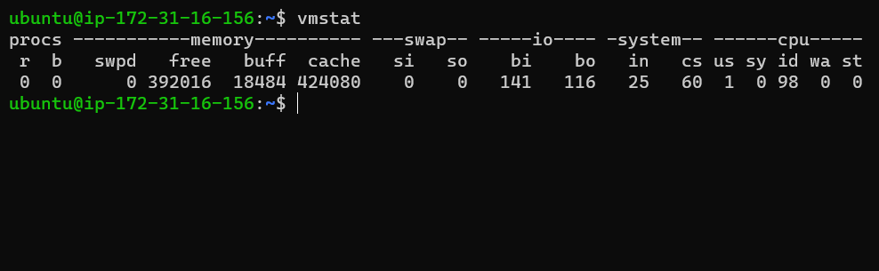
___
#### tree .
The `tree` command is used to get directory structure in the form of a tree. Paste output in your Github Readme to make your project directory easy to understand for a second person. 
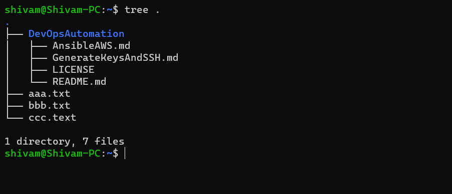
___
#### unmask
___
#### netstat -tulpn | grep LISTEN
Use `netstat -tulpn | grep LISTEN` to get the list of all open ports. Helpful when working with docker images, port binding, deploying Restful APIs to get the ports that are already busy or to check which port you have deployed your API.
```bash
sudo netstat -tulpn | grep LISTEN
```

___
#### dmesg
`dmesg` stands for driver message. It gets boot time logs. If your system faces a boot time error. You can read the logs and try to identify the error.
Boot time logs: dmesg
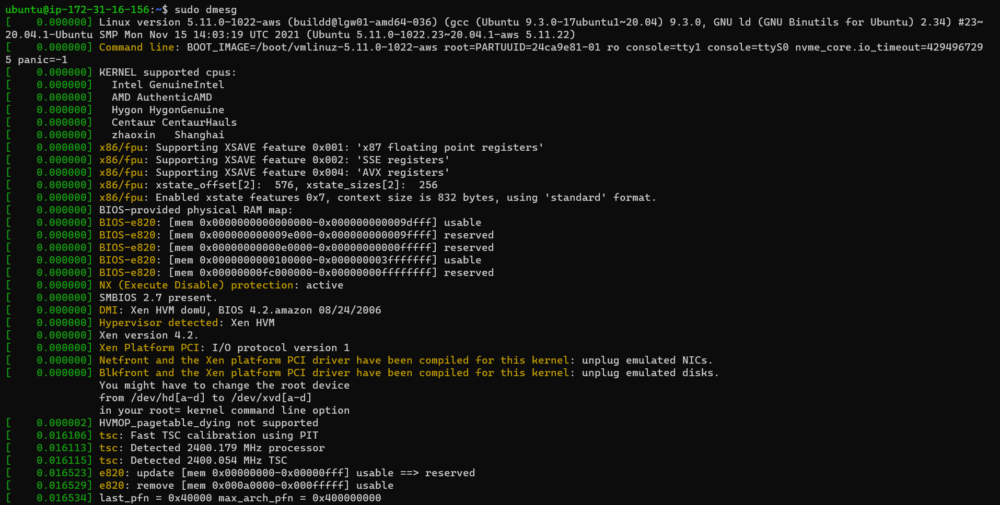
___
When you are working on servers there are no IDEs and you have to use `vim` or `nano` to edit a file. But if you want to just empty a file then the fastest way is
```bash
echo "" > file.txt
```
using vim and nano in this situation could be tidious.
___
What is the shebang line in shell scripting?
___
input.txt | python3 my-program.py > output.txt
___
#### base64
Linux Systems encode and decode data for I/O and data transmission. Please note that encoding and decoding are not similar to encryption and decryption.

All linux systems use `base64` for encoding and decoding. base64 is used internally and in general purpose a user doesn't need to bother about it, but in some cases a developer might need to provide raw input to a file in such case we need to encode input and pass input. 
  
  To encode data:
```bash
echo  'A B C D' | base64
```
To decode data
```bash
echo  'QSBCIEMgRAo=' | base64 --decode
```
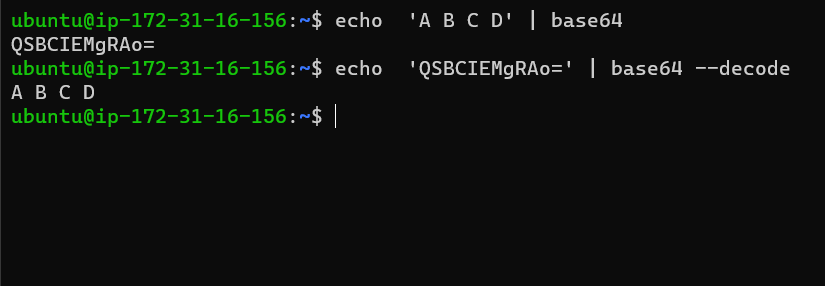
___
I want to read all input to the command from file1 direct all output to file2 and error to file 3, how can I achieve this command <file1 1>file2 2>file3
awk
___
#### df -i
Linux Systems recognizes file with Inode Numbers and not with names.  
The no of available Inode Number gives the maximum number of files that can be accomodated in the disk or file system. 
Use `df -i` to get available node number
```bash
df -i
```
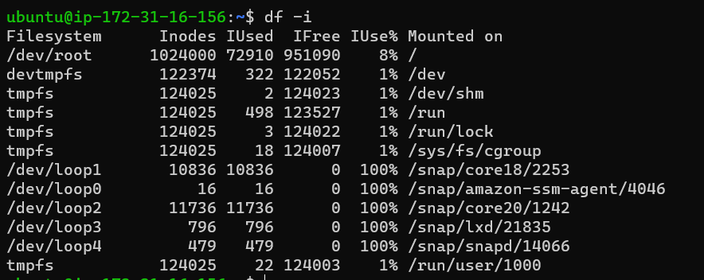
___
sticky bits in linux permission
___
###### What is return code in bash/shell scripts?
There are 256 return codes ranging from 0 - 255
Every Bash script has a return code. The code could be as follows:-
0 for success  
1 - 255 for different types error

