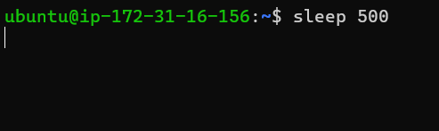
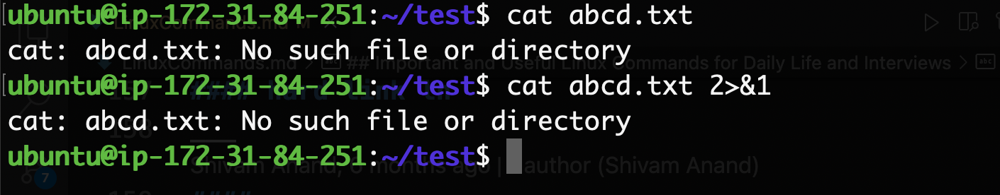
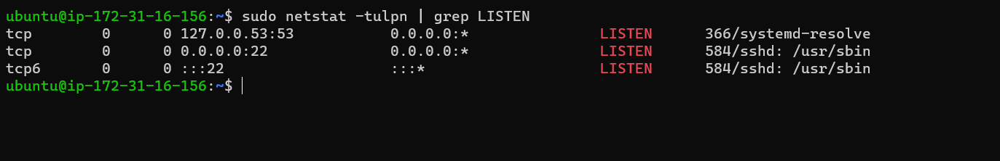

## Important and Useful Linux Commands for Daily Life, Interviews and tricks

__________________
#### pushd popd dir
pushd and popd both are a combination of commands that are used to navigate file-system very similar to cd command. Their special feature is that they can store your paths in a stack
```bash
pushd my-folder-1-path # change my directory to folder 1
pushd my-folder-2-path # change my directory to folder 2
pushd my-folder-3-path # change my directory to folder 3
# You are currently in folder 3 and folder-2 and folder-1 are also in stack
# Now you can go back to folder-2 using
popd
# Now you can go back again to folder-1 using
popd
```
`pushd` & `popd` are used when you are navigating FS and want to go back to your previous folder quickly. It is conceptually a stack.
__________________
#### cron cronjob crontab
Cron is a system to schedule and automate a task. Say you want to run a program every 5 minutes you can do it using cron.  

Cronjob is the actual task defined in the system. While cron can be thought of as a concept/program, cronjob is the actual entry in the system that will do the work. 

Crontab is a table that is defined in a file. This file contains list of all jobs.  
```bash
crontab -e # edit file to add cron jobs
crontab -l # list all automated jobs
```


___
#### free
`free` command gives you details about the Primary Memory(RAM) and swap memory.
```bash
free
free -h # h for human readable
```

___
#### ps 
ps is Process Status
ps command gives you the list of running process and their PID. ps command is non-interactive and can be used with shell scripts.
```bash
pa -A # Get all processes
ps -a # get all processes not associated with a terminal
ps -u # view processes along with their owner 
ps -x #view process owned by current user(you)
```
```bash
ps -aux 
```

___
#### Difference between jobs, ps, top and htop
jobs give the processes that is attached to the current terminal/shell.

ps is non-interactive and can be used with shell scripts.

top is interactive 

htop is advanced form of top
___
#### difference vi and vim
vim is vi improved. Both of them are text editors. Vim is an extended form of vim with more functionalities. Example vim supports multi level undo and redo.
___
#### Keep SSH session Alive
Does your SSH session breaks?
Here is a one time fix
```bash
ssh -o ServerAliveInterval=60 -i ~/path/key.cer  ubuntu@xx.xx.xxx.xx
```
___
#### top
`top` is an interactive tool. It shows the processes running in your system. Along with it also shows hardware details like CPU usage, RAM Usage, swap memory usage and no of tasks running.
```bash
top
```

___
#### htop
`htop` is a similar tool like `top` with some more features added like colors, bars etc.  
It is an interactive tool. 

```bash
htop
```
___
#### anacron
`Anacron` is related to `cron` but has a lot of differences. Anacron is used to schedule tasks. It has an advantage over cron, it can run tasks even after the system was shut down, the next time systems starts. It has an disadvantage over cron. Its time granularity is low. Cron has accuracy in minutes but anacron has accuracy in days.  
Use case: You might want to cackup your local favourite folder to cloud, you are not in a hurry if your backup is done a few hours later or tomorrow.
___
#### Ctrl + r (Windows and Linux)
Ctrl+R: Recall the last command matching the characters you provide. It will search BASH/sh history with the matching works you type. Helps save a lot of time and you should definitely learn to use it.
___
#### chmod
chmod is change mode.chmod command is used to change the permission of a file. It can change read, write and execute permission of user, group and others. 
```bash
chmox +x file.sh # Add execute permission to a file
```
___
#### chown
chown command is used to change the owner of a file
Example: If in a system there are users say Rick and Morty. Morty created a file and he is the owner. Now to change the owner to Rick you would do
```bash
chown Rick filename.txt
```

___
#### uptime
It gives how long the systemhas been running.

___
#### cal
It gets calender of the current month in terminal.
```bash
cal
```
```bash
    January 2022
Su Mo Tu We Th Fr Sa
                   1
 2  3  4  5  6  7  8
 9 10 11 12 13 14 15
16 17 18 19 20 21 22
23 24 25 26 27 28 29
30 31
```

___
#### sleep
Create a thread that does nothing for n seconds. Use it to create a delay in your shell script or start a useless process.
```bash
sleep 500
```

___
###### run a command in background using '&'
You can run a command line process in background by ending it with `&`
```bash
python3 program.py &
```
or
```bash
# Create a thread that does nothing for 500 seconds and send it to background
sleep 500 &
```

___
#### jobs
The `jobs` commands keep a track of all the processes running in the background and foreground by shell.

___
###### Ctrl + z
Ctrl + z pauses/suspends a program. You can start the same program in foreground using `fg` command or you can run it in background using `bg` command.
___
#### fg
`fg` stands for foreground. You can bring back a process in foreground that was running in background or you can resume a suspended process using `fg` command.  
If there are multiple processes then you might want to pass parameters also like `fg 3` for third process.
```bash
fg
```

___
#### bg
`bg` stands for background. You can resume a suspended process in background using the bg command.  
If there are multiple processes then you might want to pass parameters also like `bg 2` for second process. 
```bash
bg
```

___
###### Difference between bash vs shell
Bash is an extended form of shell. It has more features than shell like endless logs, better compatability with interactive tools like vim and nano.  
bash is located in `/bin/bash` and shell is located at `/bin/sh`.
___
#### ssh
SSH stands for Secure Shell Protocol is used to connect to remote hosts securely. It is some of the most used commands for people who engage themselves with cloud.
``` bash
# ssh -i /path/to/public_key_file [user]@[IP]

ssh -i ./practise.pem ubuntu@3.91.160.159
```
if you ssh very frequently and do not want to use the -i command repeteadly then follow https://github.com/anandshivam44/DevOpsAutomation/blob/main/GenerateKeysAndSSH.md
```bash
ssh ubuntu@3.91.160.159
``` 

___
#### ping
Ping is used to check the network connectivity to a specified address or IP.
```
ping github.com
```

___
#### kill
It is used to terminate or kill a process manually.
Example: You get PID of a process via `ps -A` command and you terminate the process by
```bash
kill PID
```
___
#### du -sh /var/
gives the disk space occupied by a directory in human readable format
```bash
du -sh /var/
```

___
#### grep 
It is a very popular command in linux. This command is used to search for a text/pattern in a command output or text/pattern in a file.
Example: To find in history all the chmod command you used.
```bash
#pipe the output of history command to grep which will search for sed commands.
history | grep sed
```

```bash
#find all process associates with python
ps -aux | grep python
```

___

#### pkill
pkill command is used to kill a process by it name or partial name and not by its PID number
Example: There is a pyhton program running. You can terminate it by
```bash
pkill python
```
___
#### sed
sed stands for stream editor. It is mostly used to find a replace a word or regex pattern in a file without opening it in any editor like nano, vim, vi. It can also do tasks like insertion, deletion and searching based on regex patterns.
Example: replace all unix in a file with linux
```bash 
 sed -i 's/unix/linux/g' geekfile.txt
```
`s`: substitute
`g`: do the operation globally

___
#### soft link ln -s
Softlinks are like Desktop shortcuts you had in your Windows PC. They point to a file. They just store the path of another file and pretend to behaves like the original file but they aren't.  
Softlinks are called symbolic links. size of a softlink is in bytes or KB because they just store path of a file. If you delete the actual file in the disk then the softlink file will be pointing to null(nothing) and will have no relevance.

```bash
# ln -s {source-filename} {symbolic-filename}
ln -s file1 shortcut_file
```
___
#### hard link ln
Every file in linux has a inode number. This inode number points to an object in teh disk. When you see a file in file explorer. It is just pointing to the object using its Inode Number.
When you create a hard link, you can see another that points to the same object using the same inode number. Both the files are same just different representation. Both file show the same content. If one of them is deleted the other file remains.

Size of a hard link is the actual size of the file because it points to inode number object in the disk

```bash
# ln {original-filename} {hardlink-filename}
ln file1 shortcut_file
```
___
#### rsync
rsync is remote synchronization. Used to sync files between two remote directories. It can also be used to copy files in your local machine.

It is very useful when you are copying a very large folder. Iven if copying breaks in between you can re-run the rsync command and locially it will be like a resume feature.

```bash
rsync ~/local-file.txt user@remote-host:~/remote-file.txt

rsync -vh ~/local-folder user@remote-host:~/remote-folder

rsync -vh ~/local-folder-1 ~/local-folder-2
```
___
###### What is dev/null?
To understand easy, assume `dev/null` is a Black Hole. You can direct output of any commant is scripts to dev/null but it will not be saved anywhere and will not occupy any disk space.  
Use case: If you direct the output of a script to a file then the error message wil be output to a file and your terminal will not show any error. So in our case `dev/null` as a file. A file that doesn't saves anything & doesn't occupies space, direct all spam and noise to this file.

___
#### what is 2>&1
We use `2>&1` in the end of bash or shell commands/scripts to redirect the stderr to stdout. Descriptor 1 stands for standard output and descriptor 2 stands for standard output. It is used to supress error by showing it in output and avoid breaking of our script.
```bash
cp abcd.txt ./not-a-folder 2>&1
```
Below the difference between both the return value is that the first one is an error while the second value is an output


___
#### curl ifconfig.me
```bash
curl ifconfig.me
```
It is used to get your current IPv4

___
#### ifconfig
Full form of ifconfig is Interface Configuration.
It is used to get and change the network configuaration of the system.  
In the below we can see that our internal ip of the system is 172.31.84.251
```bash
sudo apt install net-tools
ipconfig
```

___
#### Difference between .bash_profile & .bashrc

`.bash_profile` is a hidden file which always executes when a user open a new shell/BASH session but it doesn't execute when a shell script is invoked by another process  

`.bashrc` is a hidden file. It always executes when an interactive or non-interactive shell session starts.


Similarly for mac users we have `.zprofile` `.zshrc` with same behaviour.
___
#### wc
It is used to find out the number of word in a line. `wc` stands for word count.  
  
Default output gives `the number of lines`, `no of words`, `the number of characters in the file`


___

#### nohup
nohup is `No hangup`
nohup gives the best way to run a process in background.  
it allows to runa  process in background even if the terminal session is closed or SSH tunnel breaks.
Example: you have a shell script `my-script.sh` which you want to run in the background
```bash
# nohup ANY_BASH_COMMAND &
nohup sh my-script.sh & # run a program in background
nohup sh my-script.sh > output.log & # run a program in background and send output to a file
```
nohup makes running commands over SSH connections reliable. Imagine you ran a critical shell script and the connection breaks and your script didn't complete. 
___
___
___
#### env
It is used to print all BASH environment variables
```bash
env
```

___
#### vmstat
`vmstat` stands for Virtal Memory Statistics. It privides system information like memory, paging, processes, IO, CPU, and disk scheduling.
```bash
vmstat
```


___
#### tree .
The `tree` command is used to get directory structure in the form of a tree. Paste output in your Github Readme to make your project directory easy to understand for a second person. 

___
#### umask
umask command is used to set the default permission for new files. The default mask for a non-root user is 002, changing the folder permissions to 775 (777-002=775 rwxrwxr-x), and file permissions to (666-002=664)664 (rw-rw-r--)

___
#### netstat -tulpn | grep LISTEN
Use `netstat -tulpn | grep LISTEN` to get the list of all open ports. Helpful when working with docker images, port binding, deploying Restful APIs to get the ports that are already busy or to check which port you have deployed your API.
```bash
sudo netstat -tulpn | grep LISTEN
```

___
#### dmesg
`dmesg` stands for driver message. It gets boot time logs. If your system faces a boot time error. You can read the logs and try to identify the error.
Boot time logs: dmesg

___
#### Empty a file fast
When you are working on servers there are no IDEs and you have to use `vim` or `nano` to edit a file. But if you want to just empty a file then the fastest way is
```bash
echo "" > file.txt
```
using vim and nano in this situation could be tidious.

___

What is the shebang line in shell scripting?
Scripring can be done using python, shell, BASH, perl etc. Now you can define at the start of a script file which interpreter or command to use to run the file.  

Example Bash scripts can have this at the start of the file to specify the path of bash to use.
```bash
#!/bin/bash
.
.
.
commands..
.
.
.
```
or
```bash
#!/usr/bin/bash
```
or
```bash
#!/usr/bin/env bash
```
shell can have
```sh
#!/bin/sh
```
or
```sh
#!/usr/bin/sh
```
python
```python
#!/usr/bin/python
```
or a specific version of python
```python
#!/usr/bin/python3.9
```
ruby
```ruby
#!/usr/bin/ruby
```
PHP
```php
#!/usr/local/bin/php
```
___
#### Read input from a file and print output to a file
You can pass input to a file and then print the output from the program to a file. Helpful when you have large outputs or large outputs and want to run programs faster.
```bash
cat input.txt | python3 my-program.py > output.txt
```

___
#### base64
Linux Systems encode and decode data for I/O and data transmission. Please note that encoding and decoding are not similar to encryption and decryption.

All linux systems use `base64` for encoding and decoding. base64 is used internally and in general purpose a user doesn't need to bother about it, but in some cases a developer might need to provide raw input to a file in such case we need to encode input and pass input. 
  
  To encode data:
```bash
echo  'A B C D' | base64
```
To decode data
```bash
echo  'QSBCIEMgRAo=' | base64 --decode
```

___
#### df -i
Linux Systems recognizes file with Inode Numbers and not with names.  
The no of available Inode Number gives the maximum number of files that can be accomodated in the disk or file system. 
Use `df -i` to get available node number
```bash
df -i
```

___
#### sticky bits in linux permission
sticky bits are useful when there is a shared folder for multiple user/groups. Sticky bit will restrict deleting a file create by a user A by another user B and vice versa.
```bash
chmod +t folder_name
```
___
#### find
```bash
```
___
###### What is return code in bash/shell scripts?
There are 256 return codes ranging from 0 - 255
Every Bash script has a return code. The code could be as follows:-
0 for success  
1 - 255 for different types error

##### Difference between /bin/sh /bin/bash
 sh/Shell is an interface between the User and Linux Kernel. Bash is just Shell with more features. Bash is the default Scripting Tool provided in most linux terminal.
 Bash is located at `/bin/bash` and shell at `/bin/sh`. To run a command with shell explicitly you would use
 ```bash
 /bin/sh shell-script.sh
 ```

